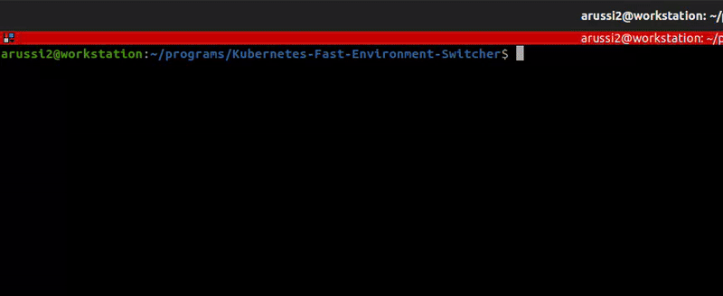

# KUBERNETES-FAST-ENVIRONMENT-SWITCHER

*Switch Kubernetes Environments Effortlessly, Boost Productivity*


## Why Kubernetes-Fast-Environment-Switcher?

This project enables effortless switching between Kubernetes environments, streamlining your workflow. The core features
include:

- 🧩 **Seamless Switching**: Easily toggle between multiple Kubernetes configurations with a user-friendly interface.
- 🔍 **Binary Checks**: Automatically verifies the presence of necessary binaries, ensuring smooth operation.
- 🛠️ **Error Management**: Effectively handles user inputs and reports errors, providing a hassle-free experience.
- 🚀 **Productivity Boost**: Streamlines Kubernetes management, allowing developers to focus on building rather than
  configuring.
- 🤝 **Open Source Collaboration**: Built under the MIT License, promoting innovation and community contributions.

# Getting started

## Installation

1. **Make required directories**:

```shell
mkdir -p ~/.kube ~/.programs
```

2. **Clone the repository**:

```shell
cd ~/.programs
git clone https://github.com/pingmyheart/Kubernetes-Fast-Environment-Switcher.git
```

3. **Make the script accessible**:

```shell
sudo ln -s ~/programs/Kubernetes-Fast-Environment-Switcher/k8s-switcher.bash /usr/local/bin/k8s-switcher
```

## Kubeconfig files location and setup

To use the tool is important to understand how it works. It will search inside `~/.kube` directory all files that starts
with `config_`.  
All the files that follow this regex will be displayed inside the script as a possible candidate to switch between
config.  
The script does not perform any check if a kubeconfig file is correct or not because the configuration applied is simply
a
Copy and Paste the content of source file into `~/.kube/config` file.  
**It is important to not have spaces between the word in file. Consider using underscores**

## Usage

