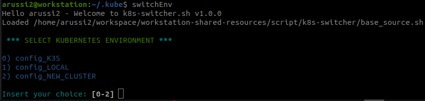

# Kubernetes-Fast-Environment-Switcher
Simple bash script to switch kubernetes configuration in main folder ~/.kube

# Introduction
The project aim is to switch between kubernetes config file easily when the final user has different environment with different `kubeconfig` files.  
To use the tool is important to understand how it works. It will search inside `~/.kube` directory all files that starts with `config_`.  
All the files that follow this regex will be displayed inside the script as possible candidate to switch between config.  
The script do not perform any check if kubeconfig file is correct or not because the configuration applied is simply a Copy and Paste of the content of source file into `~/.kube/config` file.  
**It is important to not have spaces between the word in file. Consider using underscores**  
Below there is a simple demonstration of how the tool works
